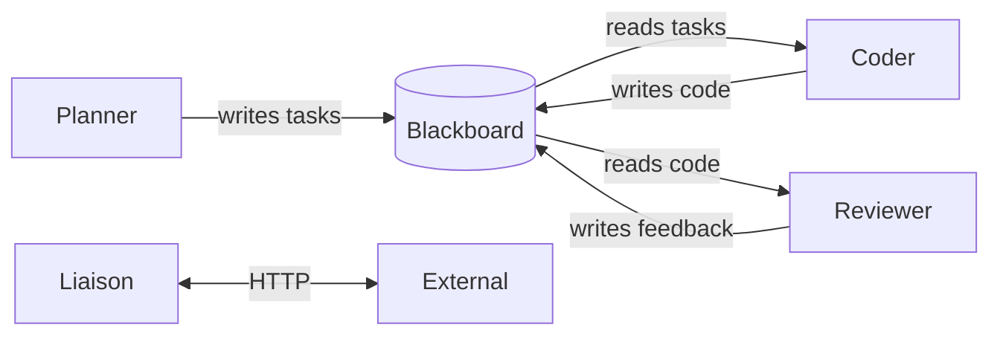

# Development Domain Skills

This container houses the development team agents focused on software engineering.

## Agents in This Domain

| Agent | Role | Primary Skills |
|-------|------|----------------|
| Planner | Technical architecture and task breakdown | System design, task decomposition |
| Coder | Implementation and coding | Code writing, debugging, testing |
| Reviewer | Code review and quality assurance | Code review, best practices, security |
| Liaison | Inter-container communication | A2A coordination, cross-domain requests |

## Coordination Pattern

## Blackboard Folder

All agents share: `/workspace/.claude/blackboard/`

## Common Workflows

1. **New Feature**: Planner breaks down → Coder implements → Reviewer validates
2. **Bug Fix**: Reviewer identifies → Coder fixes → Reviewer confirms
3. **Cross-Domain Request**: Liaison receives → Planner evaluates → Team executes
